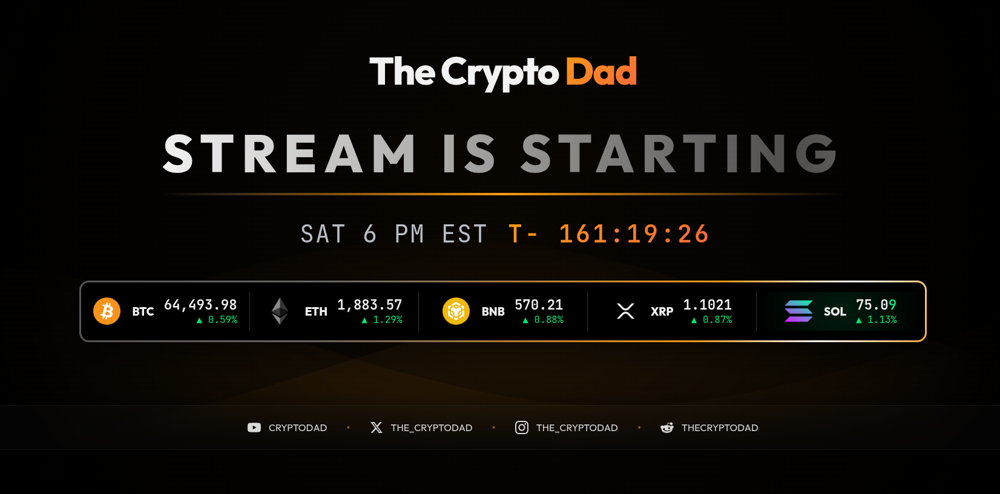

# Crypto-Dad Live Stream Intro

Live stream landing page for **The Crypto Dad** — featuring real-time cryptocurrency price tickers, a stream countdown timer, and social links.

## Features

- Real-time price data for BTC, ETH, BNB, XRP, SOL via WebSocket
- 24-hour price change indicators with directional flash animations
- Customizable stream countdown timer with date/time picker
- Fullscreen toggle
- Responsive dark-mode design

## Data Source

All live price and 24-hour change data is streamed directly from **Coinbase** (`wss://ws-feed.exchange.coinbase.com`) using their public ticker channel.

## Tech Stack

- HTML5
- CSS3 (animations, gradients, responsive layout)
- Vanilla JavaScript (WebSocket, DOM manipulation)
- Coinbase WebSocket Feed API

## Deployment

[**the-crypto-dad.vercel.app**](https://the-crypto-dad.vercel.app/)